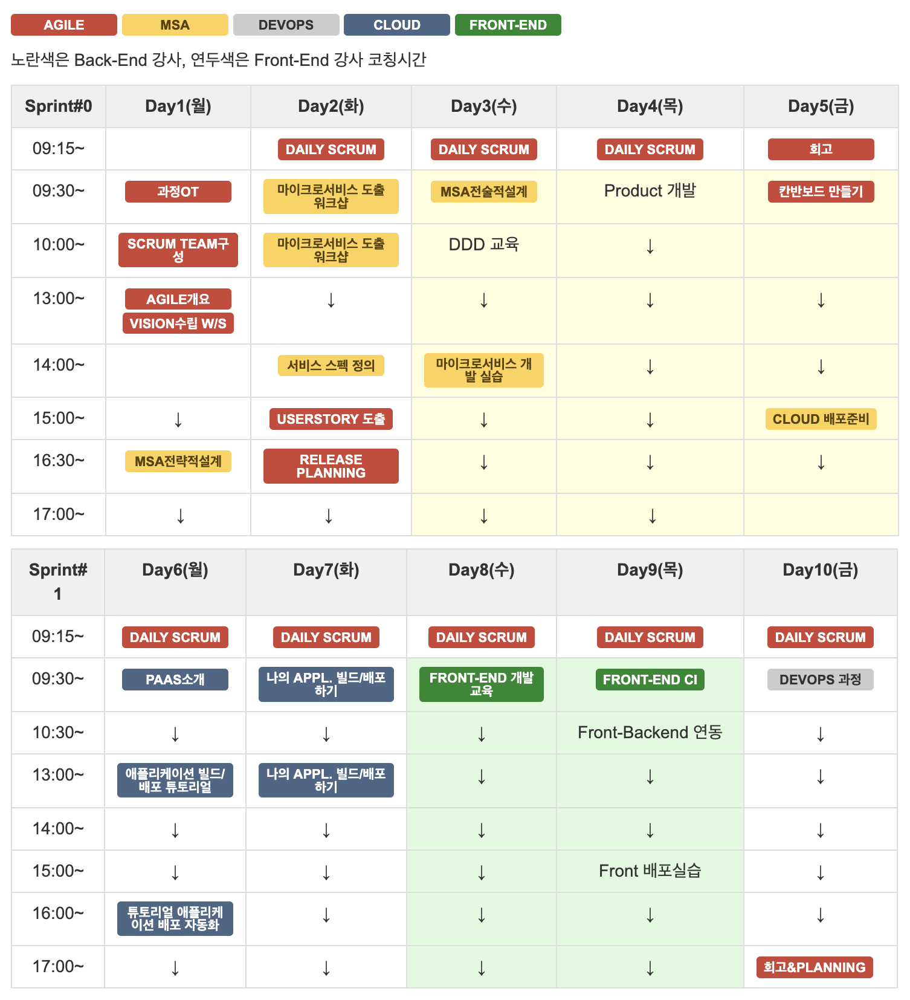

# Welcome to Application Modernization Factory

 

## AMF 입과 준비

**1. 실습을 위한 계정 생성**   
AMF 과정에서는 줌 대신 게더타운과 온라인 보드를 활용합니다.
아래 사이트에 입장하여 자신만의 계정을 각자 만드시기 바랍니다.

> - gather town 입장 : https://app.gather.town/app/9HTmUf3uGr7IR3To/AMF-L3
>  - 일단 아바타까지만 생성하시고, 비번은 당일 아침 공지해드립니다.
> - [miro.com](https://miro.com/) 가입
> - [marimba.team](https://www.marimba.team/) 가입   

**※ _모두 같은 이메일 계정으로 가입해주시고, 가능하다면 gmail 계정으로 가입을 권고합니다._**   

 

**2. 실습용 PC Spec**
>  - cpu : i7 권장, 메모리 : 8G 이상
>  - 네트워크 제한이 없어야 함 (Hynix, Innovation 등 고객사 보안에 의한 네트워크 제한이 없어야 합니다.)
 
   
**3. 개발용 Tool 설치**   
개인용 PC에 설치하고 싶은 경우, 아래 내용을 설치하시면 됩니다.   
개인용 PC설치 도중, 문제가 발생할 경우 각 과정별 담당자에게 문의하시기 바랍니다.)

>  - [ MSA 설계 관련 도구 설치 ](./msa/MSA_install.md/) : JDK, STS, Lombok, Git, Docker, MariaDB 등
>  - Back-End 개발 도구 설치
>  - Front-End 개발 도구 설치
 > - DevOps 실습 도구 설치 

 

## Time Table

 

## 학습 시간표 상세
강의 진행 상황에 따라 바뀔 수 있습니다.

###1주차 (Sprint #0)   
#### 1일차 (9:00 ~ )
- 오전 : 과정 Orientation 및 팀 빌딩
  - 09:00 ~ 09:30 : Lv.3 과정 개요 및 교육 환경 설명
  - 09:30 ~ 10:00 : App. Modernization Factory 프로그램 개요
  - 10:10 ~ 10:50 : Scrum Team 만들기
  - 11:00 ~ 12:00 : Agile 개요 및 사례 소개
- 오후 : Vision W/S 및 MSA 전략적 설계 이론
  - 13:20 ~ 14:20 : Design Thinking W/S (브레인스토밍, 아이디어 확장하기) 
  - 14:30 ~ 16:00 : 스토리보드 작성 및 비전 선언문 수립, 팀별 공유  
  - 16:10 ~ 17:40 : 
    - DDD 중심의 전략적 설계
    - 이벤트 스토밍 기법을 활용한 마이크로서비스 도출
    - 마이크로서비스 적용으로 발생하는 문제와 해결방안

#### 2일차
  - 09:10 ~ 09:20 : Daily Scrum (반복)
    - 마이크로서비스 워크샵
- 
#### 3일차

#### 4일차

#### 5일차

| 일차 | 과목명 | 주요학습 내용 |  비고  |
|---|:---:|:---|:---|
|1일차(월)|과정 Orientation|||

###2주차 (Sprint #1)   
#### 6일차

#### 7일차

#### 8일차

#### 9일차

#### 10일차

| 일차 | 과목명 | 주요학습 내용 |  비고  |
|---|:---:|:---|:---|

 
***

### [ Agile Section](./agile/about-agile.md/) 

***

### [ MSA Section ](./msa/about-msa.md/) 

#### [ Back-end Dev ](https://www.msaschool.io/operation/introduction/related-resource/) 

#### [ Front-end Dev ](***TBD) 

***

### [ ZCP Section ](./cloud-zcp/about-zcp.md/) 

### [ AWS Section ](./cloud-aws/about-aws.md/) 

### [ Azure Section ](./cloud-azure/about-azure.md/) 

***

### [ DevOps Section ](./devops/devops.md/) 

***

<EOF>